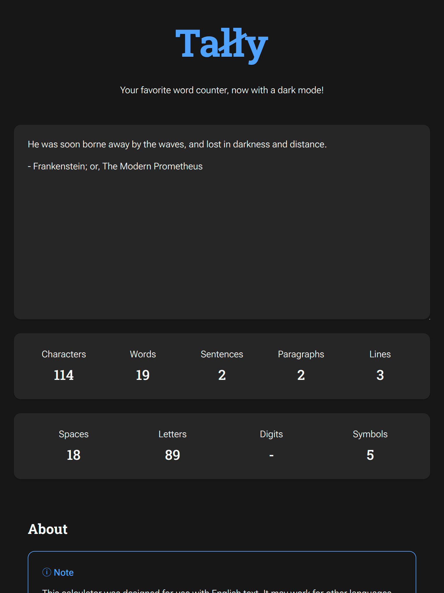
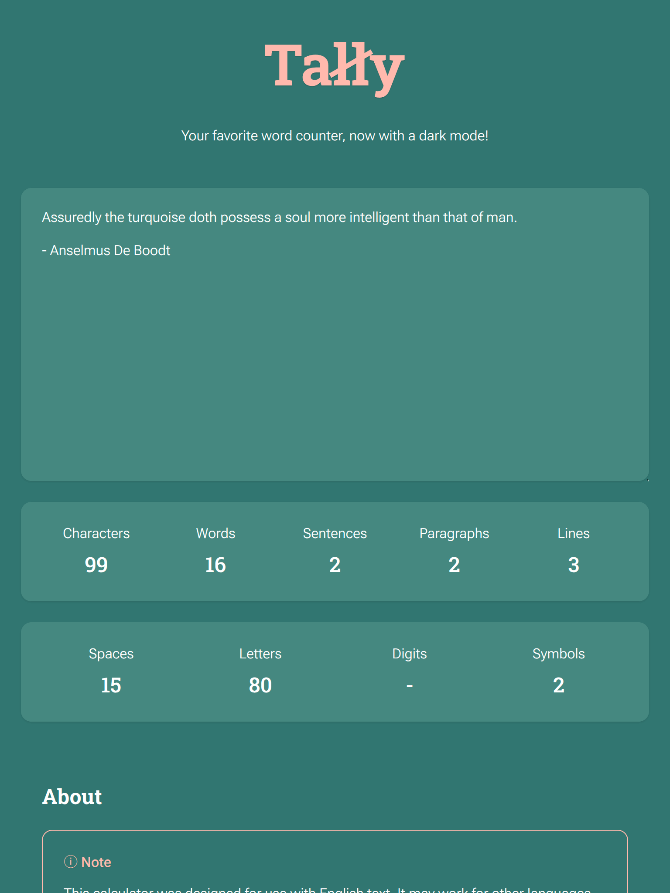
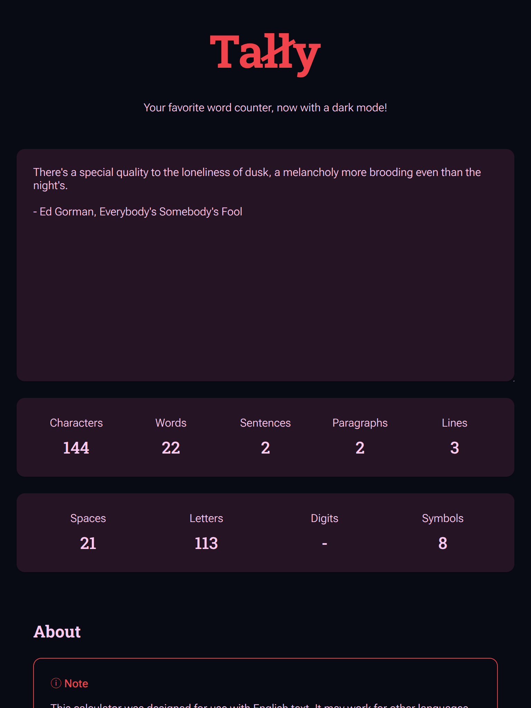
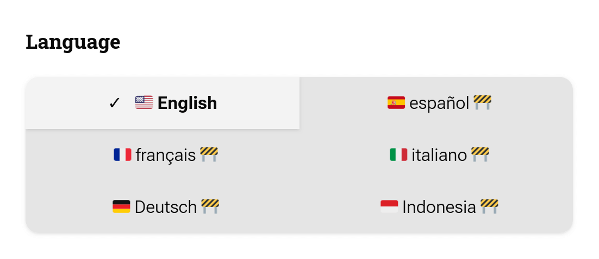
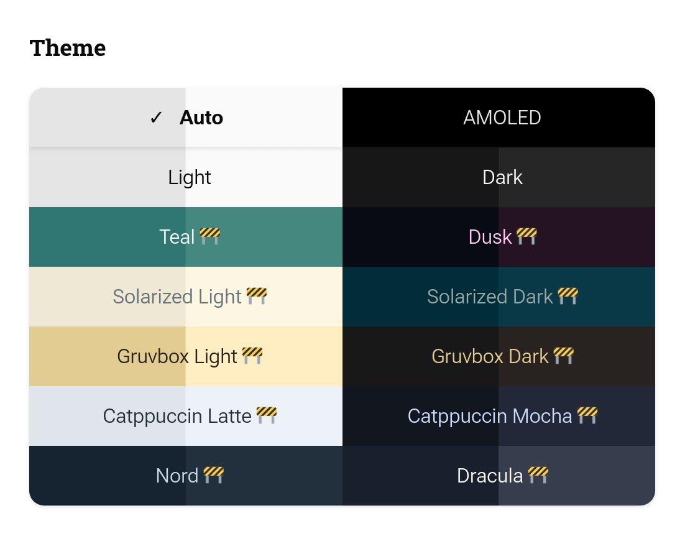
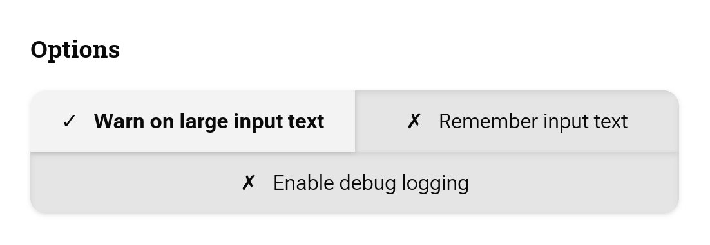
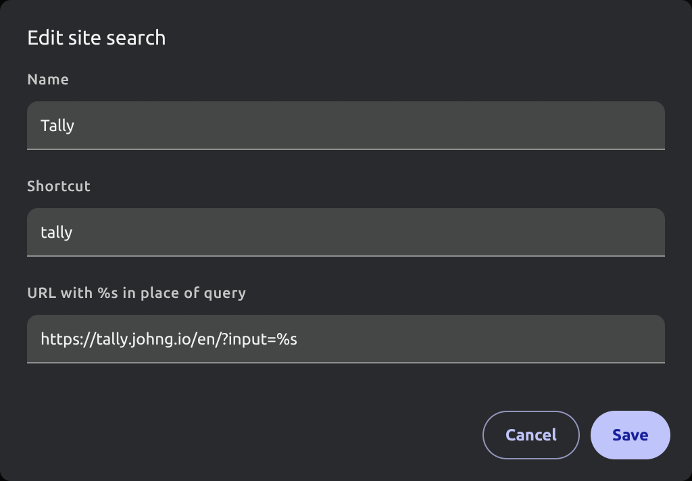

<!-- Project Header -->

	<h1 class="projectName">
		
	</h1>
	

		
		
		
		
	

	

		
	

	

		Your favorite dark mode word counter, now with even more themes! Count the number of characters, words, sentences, paragraphs, and lines in your text instantly with Tally
	

	 

## 👋 About

**Tally - Word Counter** is a free online tool to count the number of characters, words, paragraphs, and lines in your text. It can also show counts for different types of characters like letters, digits, spaces, punctuation, and symbols/special characters. Make sure you have the right number of words for your essay or post by counting them instantly with **Tally**.

### Features

- **🧮 View text metrics:** Count the number of characters, words, sentences, paragraphs, and lines in your text.
- **📊 View character composition:** View the number of spaces, digits, letters, punctuation, and symbols/special characters in the input.
- **🚀 Real-time updates:** Optimized for speed, **Tally** updates the counts in real-time as you type.
- **🌍 Multilingual support:** Accurate word and character segmentation across many languages and scripts.
- **🎨 Themes:** Save your eyes with the built-in dark mode, or try one of the other included themes.
- **🆓 100% Free & Ad-Free:** Use the tool without distractions, privacy-invasive tracking, or paywalls — no ads, no sign-ups, no limitations.
- **👨🏻‍💻 Open-source:** Know how to code? Help make **Tally** better by contributing to the project on GitHub, or copy it and make your own version!

### Use Cases

- **📚 Students & Educators:** Check essay lengths and assignment limits quickly and accurately.
- **✍️ Writers & Bloggers:** Track writing progress and optimize structure for readability.
- **📄 Legal & Business Professionals:** Ensure documents meet required character or word counts.
- **📱 Social Media Managers:** Stay within platform limits for tweets, posts, and bios.
- **🧪 Developers & Testers:** Analyze input strings and view line counts for code and data.
- **🌐 SEO Specialists:** Optimize content length for meta descriptions, headings, and body text.

### Screenshots

|  |  |
| --------------------------------------------------------------- | ----------------------------------------------------------------- |
| _Dark theme - v3_                                               | _Light theme - v3_                                                |

|  |  |
| --------------------------------------------------------------- | --------------------------------------------------------------- |
| _Teal theme - v3_                                               | _Dusk theme - v3_                                               |

### How it Works

Counting functionality is provided by the included **tally-ts** library. Refer to its [README](./src/lib/tally-ts/README.md) for more information on how the algorithm works.

## 🕹️ Usage

You can access **Tally** at [tally.johng.io]. If your preferred language is supported, you will automatically be redirected to the appropriate page. If not, we'll show the English version, but you can always manually change the language later.

Typing or pasting type into the editor will update the counts in real-time. The output counts are currently separated into 2 sections:

- **General:** Counts for characters, words, sentences, paragraphs, and lines.
- **Characters:** Breakdowns for different character types like spaces, letters, digits, punctuation, and symbols

### Languages

> [!NOTE]
> Some languages are marked as _**experimental**_. This means that the translations haven't been reviewed and/or counting accuracy has not been extensively tested for that language. If you encounter any issues with a language, please [open an issue](https://github.com/jerboa88/Tally/issues).

You can change the language with the language selector. Choosing a language changes the UI text to that language and adjusts the segmentation rules that determine how graphemes, words, and sentences are counted.

|  |
| ----------------------------------------------------------------------------- |
| _Locale selector - v4_                                                        |

Tally uses a browser API to perform segmentation, so the accuracy of your preferred language mostly depends on the browser's support for that language. Most languages follow similar segmentation rules, so even if your language is not officially supported by **Tally**, you can likely still get accurate counts by selecting a related language.

### Themes

You can change the site theme using the theme selector. If you select _**Auto**_, the site will automatically switch between light and dark themes based on your system preferences.

|  |
| ------------------------------------------------------------------------- |
| _Theme selector - v4_                                                     |

### Options

|  |
| --------------------------------------------------------------------------- |
| _Option selector - v4_                                                      |

#### Remember input text

When you enable the _**Remember input text**_ option, any text you enter is stored in your browser and restored on reload. When it is disabled, the editor stops restoring text (and erases any previously stored input text). This is disabled by default.

#### Warn on large input text

When you enable the _**Warn on large input text**_ option, the app will show a warning when you try to paste or type a large amount or text (currently 1,000,000 characters). You can choose to either continue or cancel the operation.

It can take a while to process extremely large inputs, so this option helps you avoid accidentally freezing your browser. This is enabled by default.

#### Enable debug logging

> [!TIP]
> If you submit a bug report, please include a screenshot of the console output when debug logging is enabled to help us diagnose the issue.

When you toggle _**Enable debug logging**_, the application emits extra diagnostic messages to the browser console to help you inspect internal state changes and other info for debugging purposes. This is disabled by default.

## 🤖 Advanced Usage

### Using URL query parameters

> [!TIP]
> You can pass your search parameters directly to [tally.johng.io], but if you already know what language you want to use, it is faster to use the language-specific URL (ex. [tally.johng.io/de](https://tally.johng.io/de)).

You can prefill the editor and set options by adding query parameters to the URL. This is useful for sharing preconfigured counts, automating tests, or customizing **Tally** without having to save data to local storage.

For example, perhaps you want to use the _**Teal**_ theme and disable the warning about large inputs, but you have your browser configured to clear the cache after every session. You could bookmark [tally.johng.io/en?theme=teal&warnOnLargeInputText=false](https://tally.johng.io/en?theme=teal&warnOnLargeInputText=false) and your preferences will be restored every time the page loads.

#### Input

Set `input` to a URL-encoded string to prefill the editor with this text.

**Example:** [tally.johng.io/en?input=Whoa!+This+text+was+passed+via+query+params](https://tally.johng.io/en?input=Whoa!+This+text+was+passed+via+query+params).

> [!TIP]
> You can configure your browser to use Tally as a custom search engine so that you can perform quick counts from the address bar. For example, with the following configuration:
>
> 
>
> typing
> `tally` <kbd>tab</kbd> `your input text here` into your address bar will open **Tally** with the counts already calculated.
>
> See your browser's documentation on how to configure this:
>
> - [Chromium](https://support.google.com/chrome/answer/95426)
> - [Firefox](https://support.mozilla.org/en-US/kb/add-custom-search-engine-firefox)

#### Theme

Set `theme` to a theme ID to apply that theme. You can find the full list of theme IDs in [src/config/theme.ts](src/config/theme.ts) (it is usually just the English theme name converted to camelcase).

**Example:** [tally.johng.io/en?theme=catppuccinLatte](https://tally.johng.io/en?theme=catppuccinLatte)

#### Options

> [!TIP]
> You can either use numbers like `1` or `0` or textual values like `true` or `false` to set options.

You can also set any of the supported options by passing query params. You can find the full list of option IDs in [src/config/option.ts](src/config/option.ts) (it is usually just the English option name converted to camelcase).

**Example:** [tally.johng.io/en?warnOnLargeInputText=false&rememberInputText=1&enableDebugLogging=0](https://tally.johng.io/en?warnOnLargeInputText=false&rememberInputText=1&enableDebugLogging=0)

## 🧾 License

Copyright © 2025 [John Goodliff](https://johng.io).

This project is licensed under the AGPL-3.0 License. See the [LICENSE](LICENSE) for details. The following included libraries have their own licenses:

- **tally-ts**: MIT License

## 🖇️ Related

- **👤 [Tally Chrome Extension](https://github.com/jerboa88/Tally-Extension)**: A Chrome extension to easily count the number of words, characters, and paragraphs on any site
- **👤 [Mergist](https://mergist.johng.io)**: Mergist is an online tool to combine multiple PDF files into one. Mergist has no ads, no file size limits, and your files never leave your device
- **👤 [Shared File Finder for Google Drive](https://github.com/jerboa88/Shared-File-Finder-for-Google-Drive)**: An Apps Script that finds all files/folders on Google Drive that are shared with others and adds them to a Google Sheet

## 💕 Funding

Find this project useful? [Sponsoring me](https://johng.io/funding) will help me cover costs and **_commit_** more time to open-source.

If you can't donate but still want to contribute, don't worry. There are many other ways to help out, like:

- 📢 reporting (submitting feature requests & bug reports)
- 👨‍💻 coding (implementing features & fixing bugs)
- 📝 writing (documenting & translating)
- 💬 spreading the word
- ⭐ starring the project

I appreciate the support!

[tally.johng.io]: https://tally.johng.io
