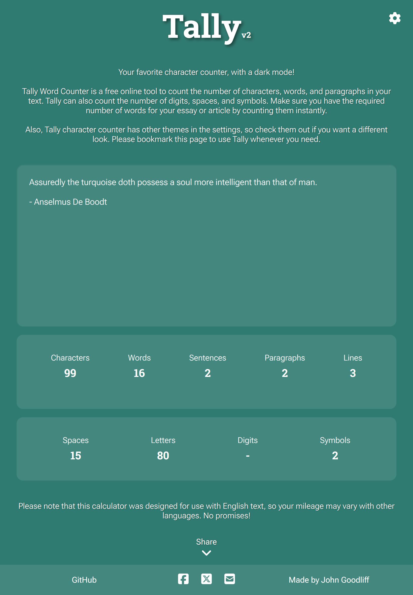
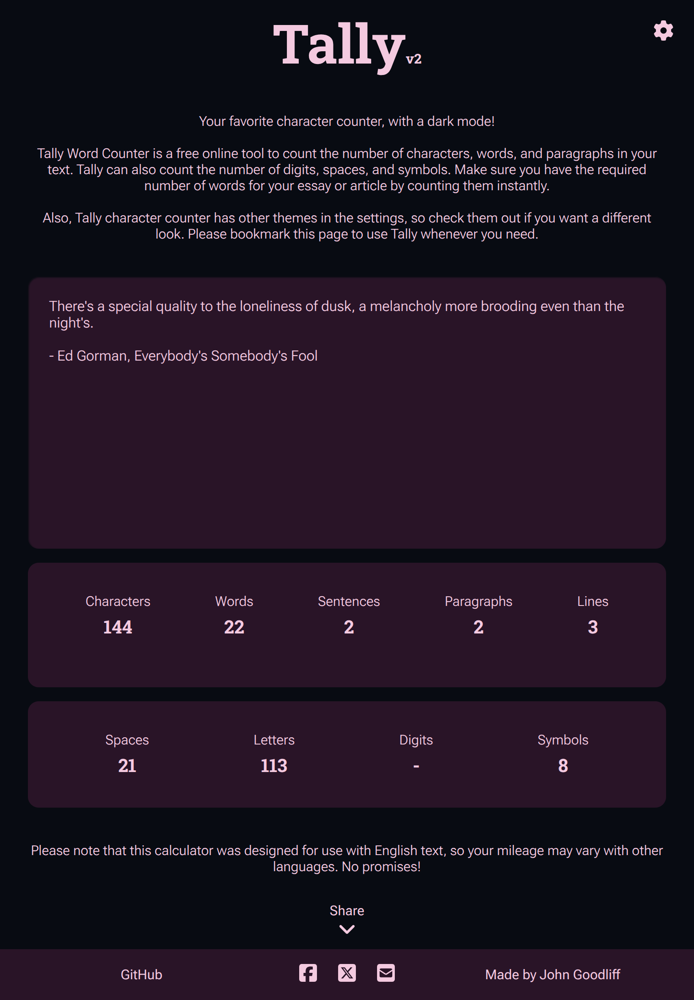

<!-- Project Header -->

	<h1 class="projectName">
		
	</h1>
	

		
		
		
		
		
	

	

		Your favorite word counter, now with a dark mode! Count the number of characters, words, sentences, paragraphs, and lines in your text instantly
	

	 

## 👋 About
> [!NOTE]
> This calculator was designed for use with English text. It may work for other languages, but I can't guarantee that the results will be accurate. See the [specification](#specification) for more details on how the calculator works.

Tally Word Counter is a free online tool to count the number of characters, words, paragraphs, and lines in your text. It can also show counts for different types of characters like letters, digits, spaces, and symbols/special characters. Make sure you have the right number of words for your essay or post by counting them instantly with Tally.

Also check out the [Tally Chrome Extension].

### Features
- **🧮 View text metrics:** Count the number of characters, words, sentences, paragraphs, and lines in your text.
- **📊 View character composition:** View the number of spaces, digits, letters, and symbols/special characters in the input.
- **🚀 Real-time updates:** Optimized for speed, Tally updates the counts in real-time as you type.
- **🎨 Themes:** Save your eyes with the built-in dark mode, or try one of the other included themes.
- **🆓 100% Free & Ad-Free:** Use the tool without distractions, privacy-invasive tracking, or paywalls — no ads, no sign-ups, no limitations.
- **👨🏻‍💻 Open-source:** Know how to code? Help make Tally better by contributing to the project on GitHub, or copy it and make your own version!

### Use Cases
- **📚 Students & Educators:** Check essay lengths and assignment limits quickly and accurately.
- **✍️ Writers & Bloggers:** Track writing progress and optimize structure for readability.
- **📄 Legal & Business Professionals:** Ensure documents meet required character or word counts.
- **📱 Social Media Managers:** Stay within platform limits for tweets, posts, and bios.
- **🧪 Developers & Testers:** Analyze input strings and view line counts for code and data.
- **🌐 SEO Specialists:** Optimize content length for meta descriptions, headings, and body text.

### Screenshots

|  |  |
| --------------------------------------------------------------- | ----------------------------------------------------------------- |
| _Dark theme - v3_                                               | _Light theme - v3_                                                |

|  |  |
| --------------------------------------------------------------- | --------------------------------------------------------------- |
| _Teal theme - v3_                                               | _Dusk theme - v3_                                               |

|  |  |
| ------------------------------------------------------------------- | ----------------------------------------------------------------- |
| _Available options  - v3_                                           | _Available themes - v3_                                           |

## 👓 Specification
> [!NOTE]
> In this specification, we refer to words, characters, spaces, lines, etc. as **_tokens_** for simplicity.

There may be slight variations between the counts generated by Tally and other word counters due to differences in how they are implemented.

The counting function is implemented as a single-pass parser for performance reasons. State transitions (sentence terminator -> letter, letter -> space, etc.) are used to determine when to increment the counts for each token type.

The following characters are used to separate tokens:
- **Space:** `' '`
- **Newline:** `\n`
- **End Mark:** `.`, `!`, `?`

**End of Input** can also be considered a separator because words, sentences, paragraphs, and lines at the end of the input are counted even if not specifically terminated. For example, `Something` is counted as a word, sentence, paragraph, and line.

Here is an overview of how we determine the counts for each token type:

| Count Type    | Description                                                                                                                                                                                                                                                                                                                    |
| ------------- | ------------------------------------------------------------------------------------------------------------------------------------------------------------------------------------------------------------------------------------------------------------------------------------------------------------------------------ |
| **character** | A Unicode **grapheme cluster** (user-perceived character), as determined by `Intl.Segmenter`. This is currently hardcoded to use the `en` locale, but other locales may work as well. Using this method, Emojis and other multi-codepoint characters are counted as a single character. **Examples:** `a`, `2`, `!`, `🔥`, `貓` |
| **word**      | A contiguous sequence of one or more **letters or digits** followed by a **space**, **end mark**, or **newline**. Symbols by themselves are not considered words. **Examples:** `space `, `Whoa!`, `newline\n`, `42`.                                                                                                          |
| **sentence**  | A contiguous sequence of one or more **words** followed by an **end mark**. **Example:** `Hello, world!`, `20 93.`.                                                                                                                                                                                                            |
| **paragraph** | A contiguous sequence of one or more **sentences** followed by a **newline**. **Examples:** `The quick brown cat jumps over the lazy dog\n`, `Hello world! Bye world!\n`, `42\n`.                                                                                                                                              |
| **space**     | A literal space character (`' '`). Other whitespace (ex. tabs, newlines) are not included.                                                                                                                                                                                                                                     |
| **letter**    | A character in the ASCII ranges A–Z or a–z. **Examples:** `A`, `j`, `z`.                                                                                                                                                                                                                                                       |
| **digit**     | A character in the ASCII range 0-9. **Examples:** `0`, `5`, `9`.                                                                                                                                                                                                                                                               |
| **symbol**    | A non-letter, non-digit, non-space, non-newline character. This includes emojis, symbols, punctuation, and most whitespace. **Examples:** `,`, `%`, `#`, `😊`, `貓`, `\t`.                                                                                                                                                      |
| **line**      | A literal newline character (`\n`).                                                                                                                                                                                                                                                                                            |

## 🧾 License
This project is licensed under the MIT License. See [LICENSE](LICENSE) for details.

## 🖇️ Related
- **[Tally Chrome Extension]**: A Chrome extension to easily count the number of words, characters, and paragraphs on any site

## 💕 Funding
Find this project useful? [Sponsoring me](https://johng.io/funding) will help me cover costs and **_commit_** more time to open-source.

If you can't donate but still want to contribute, don't worry. There are many other ways to help out, like:

- 📢 reporting (submitting feature requests & bug reports)
- 👨‍💻 coding (implementing features & fixing bugs)
- 📝 writing (documenting & translating)
- 💬 spreading the word
- ⭐ starring the project

I appreciate the support!

[Tally Chrome Extension]: https://github.com/jerboa88/Tally-Extension
