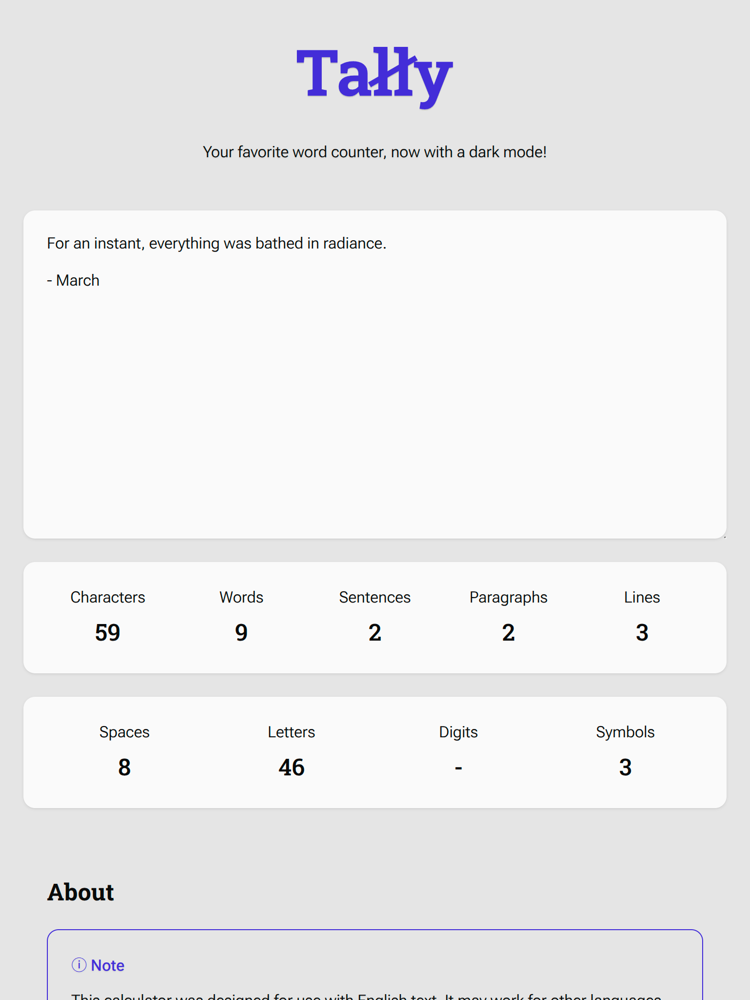
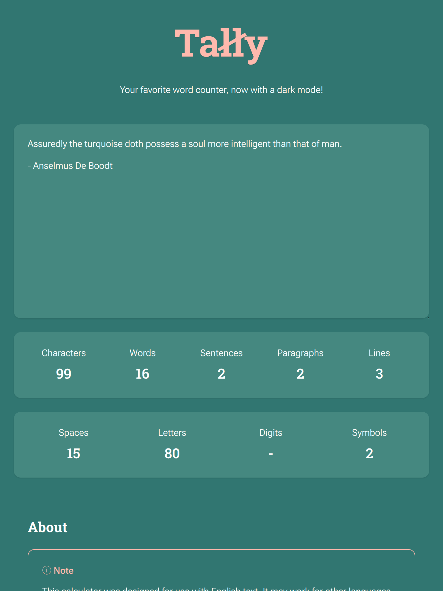
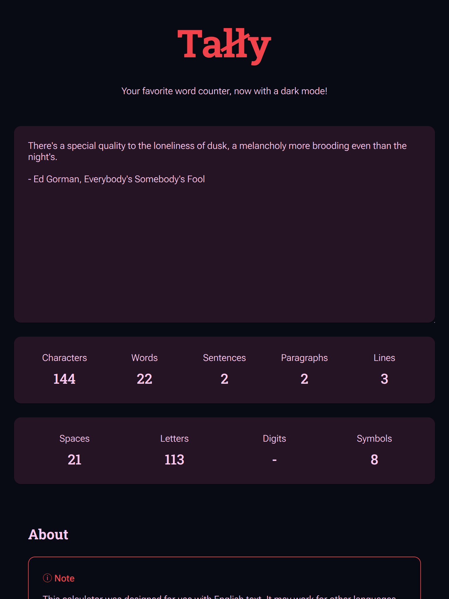
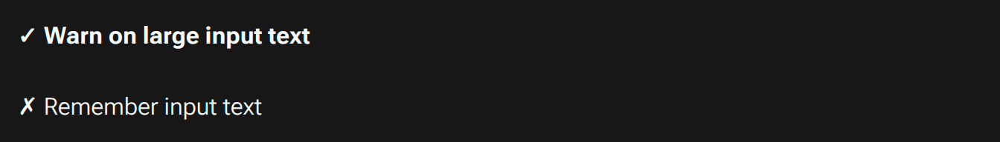
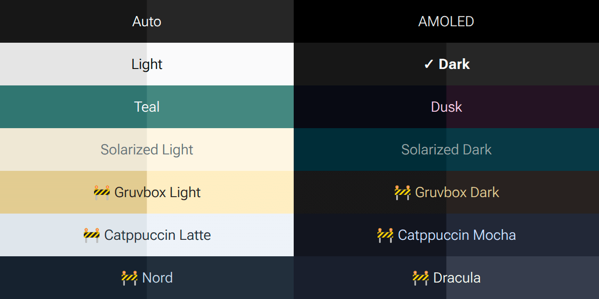

<!-- Project Header -->

	<h1 class="projectName">
		
	</h1>
	

		
		
		
		
	

	

		
	

	

		Your favorite dark mode word counter, now with even more themes! Count the number of characters, words, sentences, paragraphs, and lines in your text instantly with Tally
	

	 

## 👋 About

**Tally - Word Counter** is a free online tool to count the number of characters, words, paragraphs, and lines in your text. It can also show counts for different types of characters like letters, digits, spaces, punctuation, and symbols/special characters. Make sure you have the right number of words for your essay or post by counting them instantly with **Tally**.

### Features

- **🧮 View text metrics:** Count the number of characters, words, sentences, paragraphs, and lines in your text.
- **📊 View character composition:** View the number of spaces, digits, letters, punctuation, and symbols/special characters in the input.
- **🚀 Real-time updates:** Optimized for speed, **Tally** updates the counts in real-time as you type.
- **🌍 Multilingual support:** Accurate word and character segmentation across many languages and scripts.
- **🎨 Themes:** Save your eyes with the built-in dark mode, or try one of the other included themes.
- **🆓 100% Free & Ad-Free:** Use the tool without distractions, privacy-invasive tracking, or paywalls — no ads, no sign-ups, no limitations.
- **👨🏻‍💻 Open-source:** Know how to code? Help make **Tally** better by contributing to the project on GitHub, or copy it and make your own version!

### Use Cases

- **📚 Students & Educators:** Check essay lengths and assignment limits quickly and accurately.
- **✍️ Writers & Bloggers:** Track writing progress and optimize structure for readability.
- **📄 Legal & Business Professionals:** Ensure documents meet required character or word counts.
- **📱 Social Media Managers:** Stay within platform limits for tweets, posts, and bios.
- **🧪 Developers & Testers:** Analyze input strings and view line counts for code and data.
- **🌐 SEO Specialists:** Optimize content length for meta descriptions, headings, and body text.

### Screenshots

|  |  |
| -------------------------------------------------------------- | ---------------------------------------------------------------- |
| _Dark theme - v3_                                              | _Light theme - v3_                                               |

|  |  |
| -------------------------------------------------------------- | -------------------------------------------------------------- |
| _Teal theme - v3_                                              | _Dusk theme - v3_                                              |

|  |  |
| ------------------------------------------------------------------ | ---------------------------------------------------------------- |
| _Available options - v3_                                           | _Available themes - v3_                                          |

### How it Works

Counting functionality is provided by the included **tally-ts** library. Refer to the [README](./src/lib/tally-ts/README.md) for more information on how it works.

## 🧾 License

Copyright © 2025 [John Goodliff](https://johng.io).

This project is licensed under the AGPL-3.0 License. See [LICENSE](LICENSE) for details. The following included libraries have their own licenses:

- **tally-ts**: MIT License
- **astro-snapshot**: MIT License

## 🖇️ Related

- **👤 [Tally Chrome Extension]**: A Chrome extension to easily count the number of words, characters, and paragraphs on any site
- **👤 [Mergist](https://mergist.johng.io)**: Mergist is an online tool to combine multiple PDF files into one. Mergist has no ads, no file size limits, and your files never leave your device
- **👤 [Shared File Finder for Google Drive](https://github.com/jerboa88/Shared-File-Finder-for-Google-Drive)**: An Apps Script that finds all files/folders on Google Drive that are shared with others and adds them to a Google Sheet

## 💕 Funding

Find this project useful? [Sponsoring me](https://johng.io/funding) will help me cover costs and **_commit_** more time to open-source.

If you can't donate but still want to contribute, don't worry. There are many other ways to help out, like:

- 📢 reporting (submitting feature requests & bug reports)
- 👨‍💻 coding (implementing features & fixing bugs)
- 📝 writing (documenting & translating)
- 💬 spreading the word
- ⭐ starring the project

I appreciate the support!

[Tally Chrome Extension]: https://github.com/jerboa88/Tally-Extension
